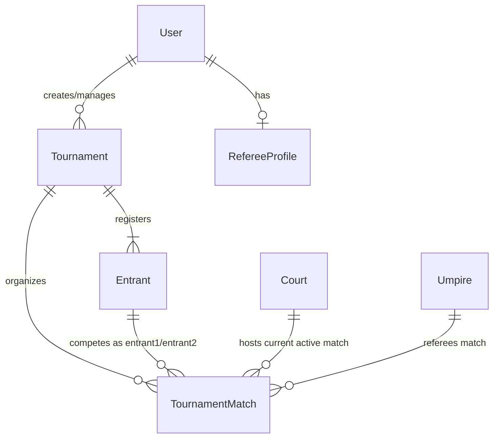
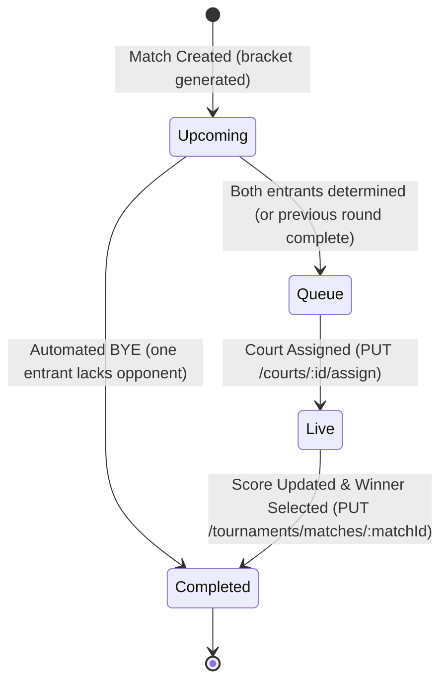
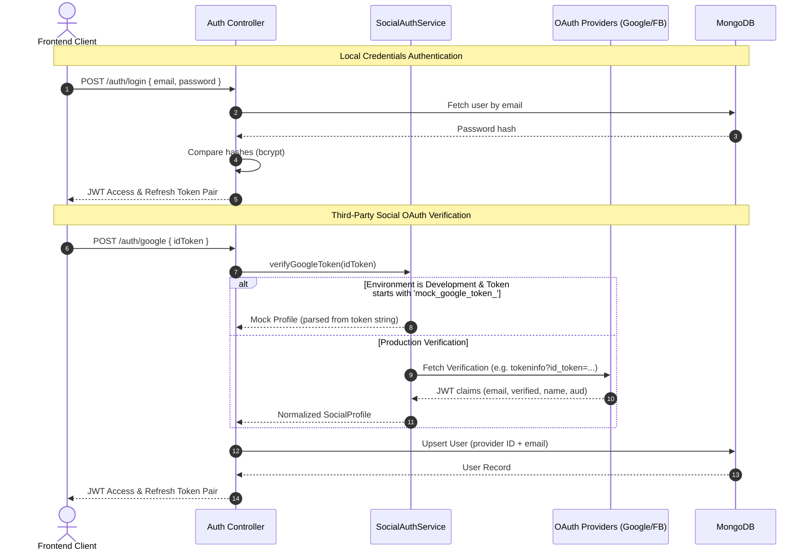

# 🏸 Scorevant Backend API

Scorevant is a high-performance, professional-grade tournament administration platform, officiating assistant, and real-time live scoring system built specifically for modern racket sports: **Badminton, Tennis, Table Tennis, Squash, and Pickleball**.

This repository houses the high-availability **NestJS REST API** that orchestrates the data models, matches brackets generation, and courts queuing systems powering the Scorevant ecosystem.

---

## 🚀 Key System Features

- 🔐 **Secure Multitenant Authentication**: Traditional credentials-based signup/login powered by `bcrypt` & JWT, paired with Google and Facebook OAuth validations.
- 🏆 **Dynamic Single-Elimination Brackets**: Automatic seed-based bracket generator supporting automated BYE propagation and dynamic winner advancement.
- 🏸 **Real-time Court Allocation & Queuing**: Active court assignment flows and matching buffers to optimize court utilization.
- 🛡️ **Hardened Enterprise Security**: Security headers handled via `helmet`, Cross-Origin Resource Sharing (CORS) configurations, and rate-limiting throttlers protect the API against malicious vectors.

---

## 📐 Architecture & System Design

The Scorevant Backend is built around NestJS modules and leverages MongoDB (via Mongoose) to represent data relationally through referenced object IDs.

### Entity-Relationship Diagram



### Match Lifecycle State Machine

A tournament match undergoes a strict state transition flow managed dynamically by the court controller and tournament engine:



### Authentication Flows

Scorevant supports traditional credentials-based login as well as third-party single-sign-on (SSO). To facilitate local development, custom Mock OAuth tokens can be sent directly to the server.



---

## 🔌 API Endpoints Reference

### 🩺 System & Health

| Method | Endpoint | Description | Payloads / Query Parameters | Authentication |
| :--- | :--- | :--- | :--- | :--- |
| `GET` | `/health` | Core service ping / health check | None | None |

---

### 🔐 Authentication System (`/auth`)

| Method | Endpoint | Description | Payloads / Query Parameters | Authentication |
| :--- | :--- | :--- | :--- | :--- |
| `POST` | `/auth/register` | Sign up a new user | `{ "email": "...", "password": "...", "fullName": "..." }` | None |
| `POST` | `/auth/login` | Log in and receive JWTs | `{ "email": "...", "password": "..." }` | None |
| `POST` | `/auth/google` | Google SSO login | `{ "idToken": "..." }` | None |
| `POST` | `/auth/facebook` | Facebook SSO login | `{ "accessToken": "..." }` | None |

| `POST` | `/auth/refresh` | Issue new access tokens | `{ "refreshToken": "..." }` | None |
| `POST` | `/auth/logout` | Log out and clear refresh token | None | Bearer JWT |
| `GET` | `/auth/me` | Retrieve profile information | None | Bearer JWT |

---

### 🏆 Tournament Engine (`/tournaments`)

*All `/tournaments` endpoints require authentication via a valid `Bearer JWT` token.*

| Method | Endpoint | Description | Payloads / Query Parameters |
| :--- | :--- | :--- | :--- |
| `POST` | `/tournaments` | Create a tournament with custom entrants | `{ "name": "Summer Open", "sportType": "Badminton", "maxSets": 3, "entrants": [{ "name": "Player A", "seed": 1 }, { "name": "Player B" }] }` |
| `GET` | `/tournaments` | Fetch tournaments created by the current user | None |
| `GET` | `/tournaments/:id` | Get details, entrants, and generated brackets for a tournament | `id` (Tournament ID parameter) |
| `POST` | `/tournaments/:id/generate-bracket` | Clear matches and build single-elimination tournament bracket | `id` (Tournament ID parameter) |
| `PUT` | `/tournaments/matches/:matchId` | Update scores, status, or finalize winner (triggers next-round progression) | `{ "score": { "set1": [21, 15] }, "status": "Live", "winnerId": "..." }` |

---

### 🏸 Court & Queue Management (`/courts`)

| Method | Endpoint | Description | Payloads / Query Parameters | Authentication |
| :--- | :--- | :--- | :--- | :--- |
| `POST` | `/courts` | Register a new court at the venue | `{ "name": "Court A" }` | None |
| `GET` | `/courts` | Get all registered courts and their occupancies | None | None |
| `GET` | `/courts/queue` | Get matches waiting for court allocation (sorted chronologically) | None | None |
| `PUT` | `/courts/:id/assign` | Match assignment (updates Court state to `In Use` and Match to `Live`) | `{ "matchId": "..." }` (URL parameter `id` = Court ID) | None |
| `PUT` | `/courts/:id/free` | Complete/suspend match and set court state to `Idle` | `id` (Court ID parameter) | None |

---

## 🛠️ Local Installation & Development Setup

### Prerequisites

- **Node.js**: v20 or newer
- **MongoDB**: A running local server `mongodb://127.0.0.1:27017/` or MongoDB Atlas URI

### Configuration File (`.env`)

Create a `.env` file in the project root:

```env
PORT=3000
MONGODB_URI=mongodb://127.0.0.1:27017/scorevant
JWT_SECRET=your-super-secure-secret-key-at-least-32-chars
NODE_ENV=development

# Note: CORS origins are currently hardcoded in main.ts

# Optional Social OAuth Client Credentials (for token audience verification)
GOOGLE_CLIENT_ID=your-google-client-id
FACEBOOK_APP_ID=your-facebook-app-id
```

### Installation

1. Install all system dependencies:
   ```bash
   npm install
   ```

2. Spin up the server in development watch mode:
   ```bash
   npm run start:dev
   ```

3. Build the application for production deployment:
   ```bash
   npm run build
   ```

4. Run the production artifact:
   ```bash
   npm run start:prod
   ```

---

## 🧪 Social Login Mock Token Testing (Development Mode)

In development environments (`NODE_ENV=development`), you can simulate social SSO without interacting with external identity providers by providing mock tokens to the endpoints:

- **Google Login (`POST /auth/google`)**:
  Provide an `idToken` matching the pattern:
  `mock_google_token_<email>_<URI_encoded_fullName>`
  *Example*: `mock_google_token_john.doe@gmail.com_John%20Doe`

- **Facebook Login (`POST /auth/facebook`)**:
  Provide an `accessToken` matching the pattern:
  `mock_facebook_token_<email>_<URI_encoded_fullName>`


Upon receipt, the `SocialAuthService` parses the email and name out of the token segment and returns a valid local JWT access token representing the user profile.

---

## 🧬 Repository Layout

```filepath
Scorevant-Backend/
├── src/
│   ├── app.module.ts              # Global app container loading configuration & routing
│   ├── app.controller.ts          # Core service ping checking route
│   ├── main.ts                    # Server bootstrapping, CORS, helmet, and validation pipeline setup
│   ├── auth/                      # Authentication subsystem
│   │   ├── auth.module.ts
│   │   ├── auth.controller.ts     # Handlers for login, register, OAuth, refresh tokens
│   │   ├── auth.service.ts        # Traditional signup/login cryptography logic
│   │   ├── social-auth.service.ts # Google, Facebook verification (production + mock client)
│   │   ├── jwt-auth.guard.ts      # Passport-based access guard wrapper
│   │   └── jwt.strategy.ts        # Strategy defining token verification parameters
│   ├── court/                     # Court allocation and queue subsystem
│   │   ├── court.module.ts
│   │   ├── court.controller.ts
│   │   └── court.service.ts       # Assigning matches to courts and updating occupancies
│   ├── tournament/                # Tournament bracket generation and match tracking
│   │   ├── tournament.module.ts
│   │   ├── tournament.controller.ts
│   │   └── tournament.service.ts  # Bye propagation logic and winner progression mapping
│   └── schemas/                   # Mongoose / MongoDB schemas
│       ├── user.schema.ts
│       ├── tournament.schema.ts
│       ├── tournament-match.schema.ts
│       ├── entrant.schema.ts
│       ├── court.schema.ts
│       ├── umpire.schema.ts
│       └── referee-profile.schema.ts
├── eslint.config.mjs              # Linter formatting compliance policies
├── tsconfig.json                  # TypeScript compiler settings
└── package.json                   # Project packages, versions, and scripts definitions
```

---

## 🧹 Code Sanitation & Quality Control

Verify code sanitation policies and run the test harness using the following commands:

```bash
# Run ESLint parser to verify file structure conforms to project guidelines
npm run lint

# Format code using Prettier
npm run format

# Run project unit tests via Jest framework
npm run test
```

---
